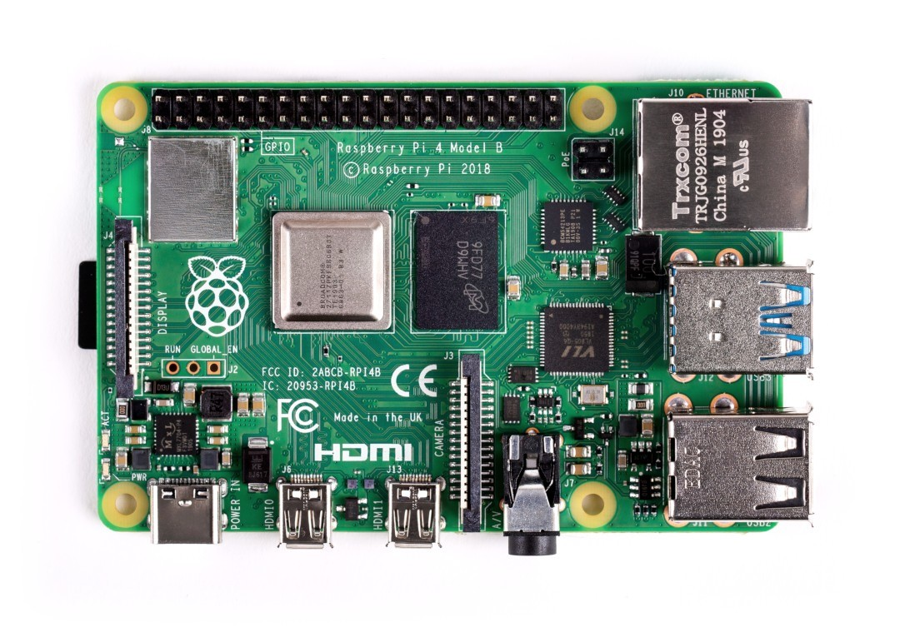
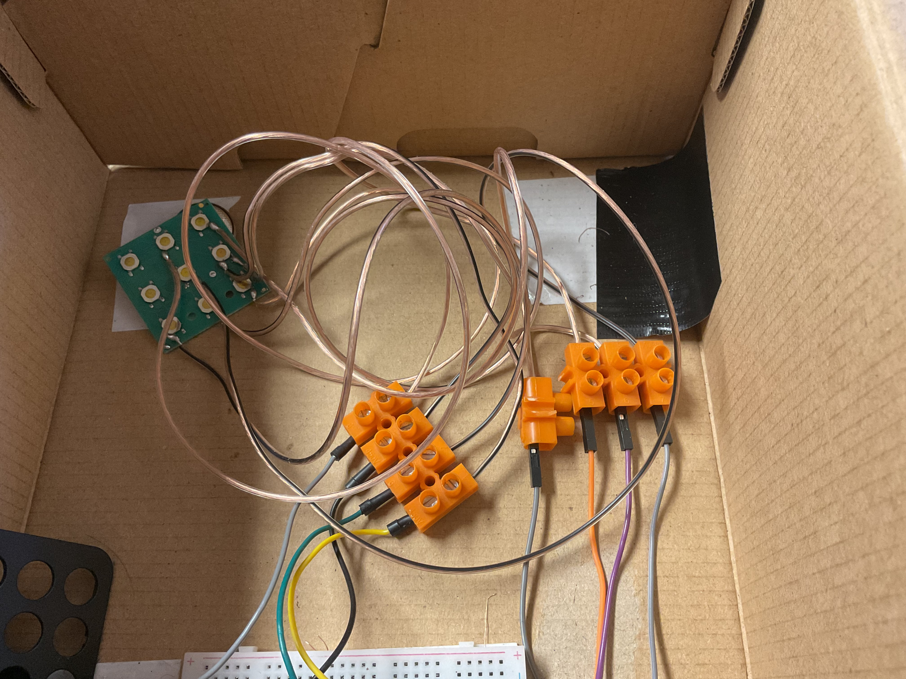

## Collecting the Needed Hardware

**Raspberry Pi 4**

The choice fell on the Raspberry Pi 4 due to its abundance of GPIO ports and the later discovered 64-bit processor, which proved crucial for the project's success. The GPIO ports enabled control over the remote, while the high performance of the board provided the computational power necessary for the smooth operation of the entire system.

**Electrical Connections**

For this purpose, simple wires for connecting LEDs proved to be the best choice 😄.
They were the most suitable for soldering to the remote and then connected in a harness with wires to the board.

**Case**

As you can see I used an old shoebox to protect the remote from anyone damaging it.
Also for the power supply I used a simple charger for a phone.

